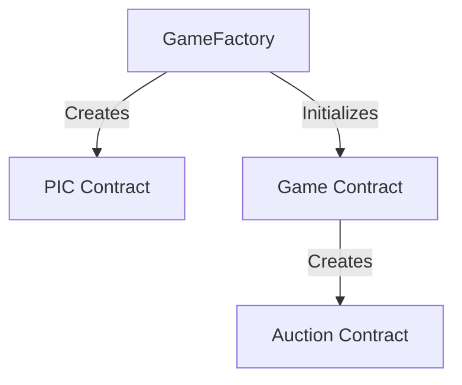
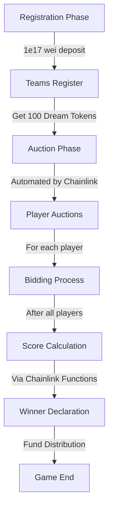
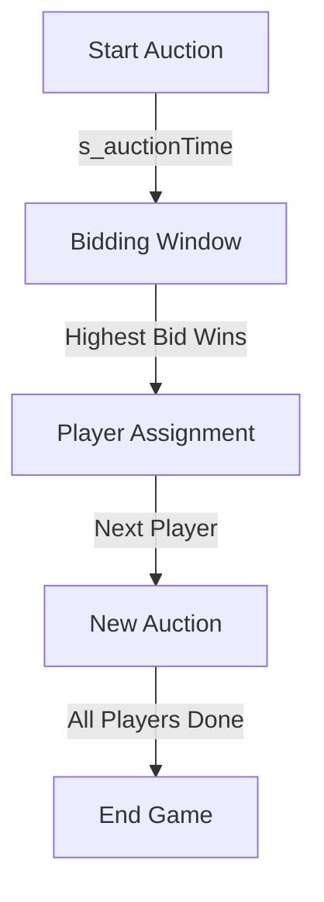

## Foundry

**Foundry is a blazing fast, portable and modular toolkit for Ethereum application development written in Rust.**

Foundry consists of:

-   **Forge**: Ethereum testing framework (like Truffle, Hardhat and DappTools).
-   **Cast**: Swiss army knife for interacting with EVM smart contracts, sending transactions and getting chain data.
-   **Anvil**: Local Ethereum node, akin to Ganache, Hardhat Network.
-   **Chisel**: Fast, utilitarian, and verbose solidity REPL.

## Documentation

https://book.getfoundry.sh/

## Usage

### Build

```shell
$ forge build
```

### Test

```shell
$ forge test
```

### Format

```shell
$ forge fmt
```

### Gas Snapshots

```shell
$ forge snapshot
```

### Anvil

```shell
$ anvil
```

### Deploy

```shell
$ forge script script/Counter.s.sol:CounterScript --rpc-url <your_rpc_url> --private-key <your_private_key>
```

### Cast

```shell
$ cast <subcommand>
```

### Help

```shell
$ forge --help
$ anvil --help
$ cast --help
```

```shell
# Deploy and verify using foundry

# GAME_FACTORY -> 0x7FD625ba0a3b5E05d1a8E0FE697eA24E0feca20C
$ forge script ./script/GameFactory.s.sol:DeployGameFactory -vvvv --broadcast --rpc-url https://base-sepolia.g.alchemy.com/v2/-rWU61cBUlLTu3wDqYfP9qvAoZErhcuh --sig "run()" --legacy --etherscan-api-key 26RASBPDQ83JTHXCXU46TCY7MRZH1IQ2C3 --verify

# GAME -> 0x7AD8970f27D3B9C204Cd555696a30cA3C69249AD
forge script ./script/Game.s.sol:DeployGame -vvvv --broadcast --rpc-url https://base-sepolia.g.alchemy.com/v2/-rWU61cBUlLTu3wDqYfP9qvAoZErhcuh --legacy --sig "run(address)" -- 0x7FD625ba0a3b5E05d1a8E0FE697eA24E0feca20C --etherscan-api-key 26RASBPDQ83JTHXCXU46TCY7MRZH1IQ2C3 --verify

# CREATE GAME
forge script ./script/GameFactory.s.sol:DeployGameFactory -vvvv --broadcast --rpc-url https://base-sepolia.g.alchemy.com/v2/-rWU61cBUlLTu3wDqYfP9qvAoZErhcuh --legacy --sig "startGame(address,address,uint256)" -- 0x7FD625ba0a3b5E05d1a8E0FE697eA24E0feca20C 0x7AD8970f27D3B9C204Cd555696a30cA3C69249AD 36000
```

# Algorithmic Steps & Mathematical Model

## Algorithmic Steps

### 1. Game Creation Flow


### 2. Game Flow


### 3. Auction Process


## Mathematical Model

### 1. Bidding Price Progression
```solidity
if (s_biddingPrice >= 10) {
    s_biddingPrice += 5;  // Linear increase by 5
} else {
    s_biddingPrice += 2;  // Linear increase by 2
}
```

### 2. Fund Distribution
```
Winner's Share = 70% of total contract balance
Treasury Share = 30% of total contract balance
```

### 3. Team Score Calculation
```solidity
TeamScore = Σ((100 - playerRanking + 1) / 10)
```
Where:
- `playerRanking` is the rank of each player (1 to 100)
- Score is calculated for each player owned by the team
- Higher ranks contribute more points

### 4. Economic Model
- Registration Cost: 0.1 ETH (1e17 wei)
- Initial Dream Tokens: 100 per team
- Minimum Bid: 1 Dream Token
- Bid Increment: 
  - +2 tokens when current bid < 10
  - +5 tokens when current bid ≥ 10

### 5. Time Model
```
Auction Duration = s_auctionTime (set during deployment)
Total Game Duration = s_auctionTime × Total Players + Processing Time
```

### 6. Player Distribution
- Total Players: Determined at deployment
- Each player can only be owned by one team
- Teams can own multiple players

### 7. Refund Mechanism
```
Refundable Amount = Previous Bid Amount (when outbid)
Refund Type = Dream Tokens
```
